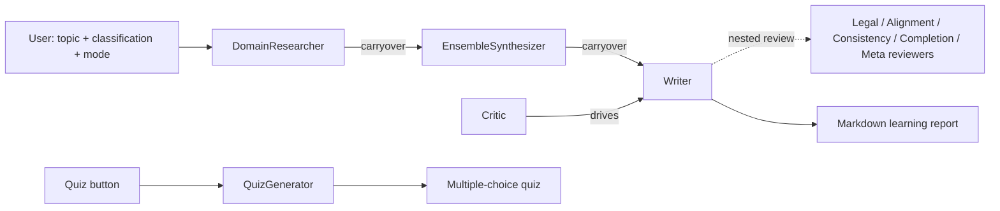

# Sage Mind

Sage Mind is an adaptive self-learning tutor: a multi-agent Streamlit application that takes any topic a user wants to learn, researches it, synthesizes a structured learning report, passes the draft through a panel of reviewer agents, and can generate a multiple-choice quiz on the result. The learner steers the output through an industry/domain classification, a learning mode, and free-text feedback. The entire system lives in one file, `sage-mind.py`, and is intended for individual learners and for demonstrating multi-agent content pipelines.

## Architecture at a glance

- **Orchestration pattern:** sequential multi-agent pipeline with a nested critic-review stage. Three chats run in order via `autogen.initiate_chats` — DomainResearcher → EnsembleSynthesizer → Writer — with `carryover` passing context between stages. A Critic agent registers five nested review chats (legal, text-alignment, consistency, completion, meta) that fire when the Writer produces output; each reviewer runs sequentially for a single turn. Everything is synchronous and blocking inside the Streamlit request.
- **Framework and model:** [AutoGen](https://github.com/microsoft/autogen) (`pyautogen` 0.2-era API) for agents and chat orchestration, Streamlit for the UI, and the OpenAI Python client. All agents use `gpt-4o`.
- **Memory / session state:** none persisted. Chat history lives in-process for the duration of a run (`clear_history: False` keeps context across the pipeline's stages); nothing is written to disk or a database, and a Streamlit rerun starts fresh.
- **Retrieval:** none. The research agent answers from model knowledge guided by its system prompt; no search tool or vector store is wired in.



## Quickstart

```bash
git clone https://github.com/git-bonda108/sage-mind
cd sage-mind
python -m venv .venv && source .venv/bin/activate
pip install -r requirements.txt
echo 'OPENAI_API_KEY=<your key>' > .env
streamlit run sage-mind.py
```

Expected output from the last command:

```
  You can now view your Streamlit app in your browser.

  Local URL: http://localhost:8501
```

Open the local URL, enter a topic, pick an industry and learning mode in the sidebar, and press **Learn Now**. A three-phase progress sequence runs while the agent pipeline executes; the finished report renders as markdown. Use the slider and **Generate Quiz** button to produce a quiz.

Note on dependencies: `requirements.txt` is broader than the application — it lists retrieval and analytics libraries (LangChain, FAISS, Pinecone, pandasai, and others) that `sage-mind.py` does not import. The app itself needs only `streamlit`, `pyautogen`, `openai`, and `python-dotenv`.

## Configuration

| Variable | What it is | Where to get it |
|---|---|---|
| `OPENAI_API_KEY` | API key used by every agent (all calls target `gpt-4o`). Loaded from `.env` via `python-dotenv`; also read directly by the AutoGen `llm_config`. | [OpenAI API keys page](https://platform.openai.com/api-keys) |

No other environment variables are read.

## Documentation

- [docs/ARCHITECTURE.md](docs/ARCHITECTURE.md) — component map, orchestration analysis, state and context choices, extension paths
- [docs/EVALUATION.md](docs/EVALUATION.md) — current test status (none) and a proposed evaluation harness
- [docs/HARDENING.md](docs/HARDENING.md) — security posture and a staged path to production
